Web application: https://car-auction-price.herokuapp.com/ (Note: Heroku removed their free tier so the web application is currently non-functioning)

# Car Auction Price Prediction

## Project Overview 

**Goal:**
* Create a tool to predict the auction selling price for cars selling on [carsandbids.com](https://carsandbids.com/)
* Practice end-to-end machine learning (ML) development, from data collection to model deployment.

**Use Cases:**
* Attract a potential seller by providing an estimate on how much their car could sell for on cars and bids.
* Help determine a reserve price.
* Help inform a buyer on how high to bid on a car.

**Why carsandbids.com?**

I wanted to use cars and bids because they include the horsepower, torque, and transmission specs of each car. It also shows exactly what the car sold / what the highest bid was. This is different then Kiji Autos or Auto Trader that has a listed price. However, as a smaller, new website there were around 1200 sold cars at the time of data collection which is a relatively small training set. Overall, this was an interesting investigation of data quality/features versus quantity of data. 

**File Summary:**
* Web Scraper: [main.py](/main.py), [scraper.py](/scraper.py)
* Collected Raw Data: [car_auction_data.csv](/car_auction_data.csv)
* Model building: [car_auction.ipynb](/car_auction.ipynb)
* Flask web app: [app.py](/app.py), [index.html](/templates/index.html), [Procfile](//Procfile), [requirements.txt](/requirements.txt), [OH_encoder.pkl](/OH_encoder.pkl), [Finalized_model.pkl](/Finalized_model.pkl)

**Results and Takeaways:** 
* An XGBoost regressor model performed the best with a mean absolute error (MAE) of around $6,900.
* This means on average the model was $6900 off the correct price of a car.
* To contextualize this, the average sale price of a car was $20,085 with a std of $21,700.
* The model performed the best by overfitting the data. Looking at the learning curve, the model would benefit from more training examples.
* Horsepower was the best indictor of selling price.
* The model understandably does well on cars where the features accurately portray the cars worth.
* The model does very poorly on cars that have appreciated in value unless the model has been trained on that car. A good example is the BMW Z8 which the model predicts would sell for around $20,000 but sells for upwards of [$180,000](https://carsandbids.com/auctions/92onPXLA/2002-bmw-z8). The BMW Z8 has appreciated greatly in value partly due to it being regarded as a good-looking car but also because of its limited production numbers. 
* Including production numbers could help the model predict these cars but the easiest way would be to train it on more cars including examples of appreciated cars.
* Many of cars on carsandbids.com are in very good condition so the model likely has a bias towards mint condition cars. There is no feature that encapsulates condition apart from mileage. 

## Data Collection 
**Libraries Used:** selenium, beautifulSoup

* A web scraper was built using selenium and beautifulSoup. 
* Selenium is a popular browser automation tool and beautifulSoup is a Python library for pulling data out of HTML and XML files.
* Features collected were vehicle: Year, Make, Model, Seller, Location, VIN, Mileage, BodyStyle, Engine, Drivetrain, Transmission, ExteriorColor, InteriorColor, TitleStatus, SellerType, Price, Reserve, Horsepower, Torque.

## Data Cleaning
**Libraries Used:** pandas, numpy, fuzzywuzzy

* Data was loaded as a panda dataframe in Jupyter notebook.
* Cars with missing data were removed.
* Various characters were removed from numerical data such as commas and $'s. Data was then converted to integers. 
* Some categorical data was simplified due to inconsistent data entry. Ex. fuzzywuzzy was used to sort sellertype as "dealer" or "private party".
* Transmission type was simplified in a similar manner for better categorical encoding.
* Seller, Location, VIN, ExteriorColor, InteriorColor, and TitleStatus features were removed.
* ExteriorColor and InteriorColor had many different values that were difficult to categorize. Example "pearl" as white or "Desert Dune Mica" as silver. This would be a good area to expand on as feature engineering can often provide increased performance besides getting more data. 
* Location is also a useful feature that was removed for the sake of time but could be a great area to improve the model.  

## Data Exploration 
**Libraries Used:** seaborn, matplotlib
* Various scatter plots, boxplots, and correlation matrices were used to investigate the data and distribution.
* Scatter plots showed some larger than possible values (HP > 2000) and these were corrected.
* Horsepower followed by torque has the largest correlation to price.

| 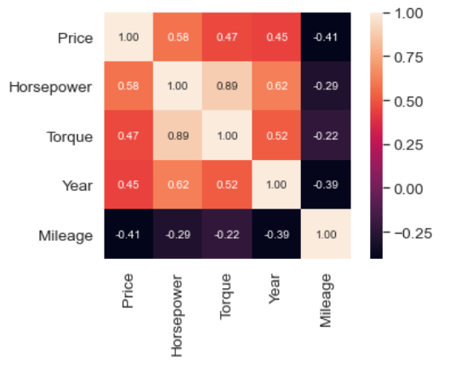 |
|:--:| 
| *Correlation matrix* |

| 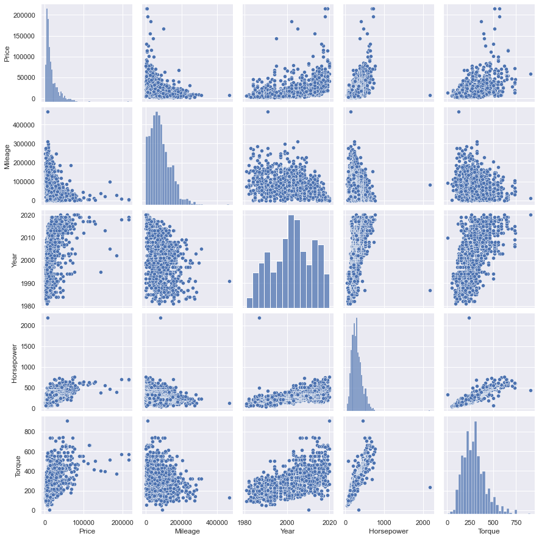 |
|:--:| 
| *Scatterplot* |

| 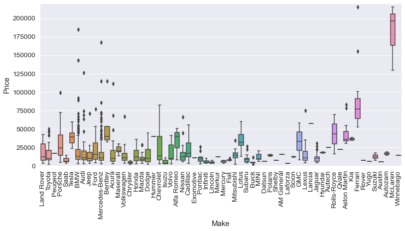 |
|:--:| 
| *Box plot of car price vs. Make* |

## Model Preprocessing, Training, and Hyperparameter tuning
**Libraries Used:** sklearn, skopt, xgboost

**Models tested:** Random forest regressor, XGboost regressor, Lasso regression, and Ridge regression

* RFR and XGBoost are decision tree-based models. 
* Lasso and Ridge both use regularized linear regression, the difference being how they are regularized. Ridge adds a penalty term which is equal to the square of the coefficient. Lasso adds a penalty term to the cost function equal to the absolute sum of the coefficients.

* Data split into test and train sets, 10-90
* A one hot encoder was used to encode categorical data (Categorical data here is not ordinal)
* However, Car makes could be considered ordinal and therefore label encoded. This would take additional work. Ex. Ferrari and McLaren labeled as 10, Honda and Ford labeled as 1. The benefit of this is features reduction because one hot encoding make adds around 50 more features. Feature reduction could benefit lasso/ridge regression. 
* Target encoding tested but OHE provided better results.
* Model trained, 5-fold cross validation and MAE used to test performance. CV is used due to the small dataset and is less susceptible to outliers however introduces some data leakage. This is because the model is being trained on some of the validation data and CV score will be somewhat inflated. 
* Learning curves were plotted to check over and underfitting.
* Hyperparameter tuning with RandomizedSearchCV and Bayesian optimization.

|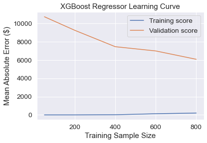 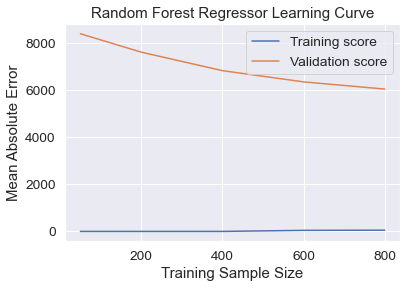|
|:--:| 
| *Test Scores: 6911, 7319* |
* XGBoost and Random forest models have similar validation scores but XGBoost was chosen because it had the lower test MAE.
* Both the XGBoost and Random forest models are technically overfitting the data (high variance). This is seen by the very low training score and much higher validation scores. This means the models are not generalizing well. However, they still provide the lower validation MAE. 
* The downward trend of the validation scores for the XGBoost and RF models also indicates that both models would benefit from more training examples.

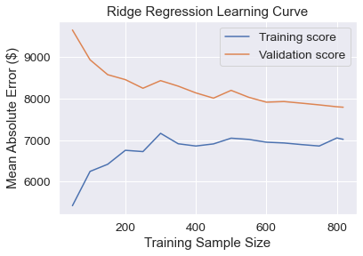 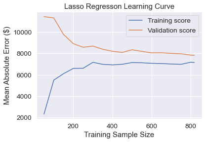
|:--:| 
| *Test Scores: 8913, 9755* |
* The ridge and lasso models indicate an okay model fit as the validation scores are not much larger then the training scores. 
* However, the overall error of the ridge and lasso models are too high. The validation and training curves have also nearly converged and are near constant which indicates that more training examples will not help. 
* When overfitting lasso and ridge models more to the data training scores improve but the models generalize poorly, and the chosen models above end up having better validation scores.

## Model Explainability
**Libraries Used:** eli5, shap, graphviz

* XGBoost model was used.
* eli5 was used to find permutation importance / feature importance. 
* It works by randomly shuffling a feature column in the dataset and making predictions using the resulting dataset. If the model relied on that feature heavily to make accurate predictions, then the results will be further off. 
* For example, horsepower is shuffled so a random horsepower stat is assigned to a car. If horsepower is a good predictor of the value of a car, then the predictions using the shuffled dataset will be wildly off.  

| 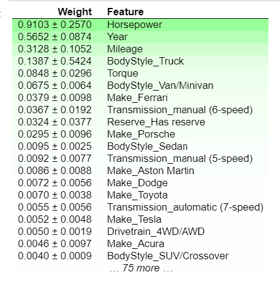 |
|:--:| 
| *Permutation Importance* |

* Feature importance shows which variables most affect predictions, but partial dependence plots show how a feature affects predictions.
* This is done by repeatedly altering the value for one variable and tracing how this impacts the outcome.
* For example, horsepower is increased from 0 to 800 for a car and the predicted price is graphed. This is done for multiple cars and averaged. 

| 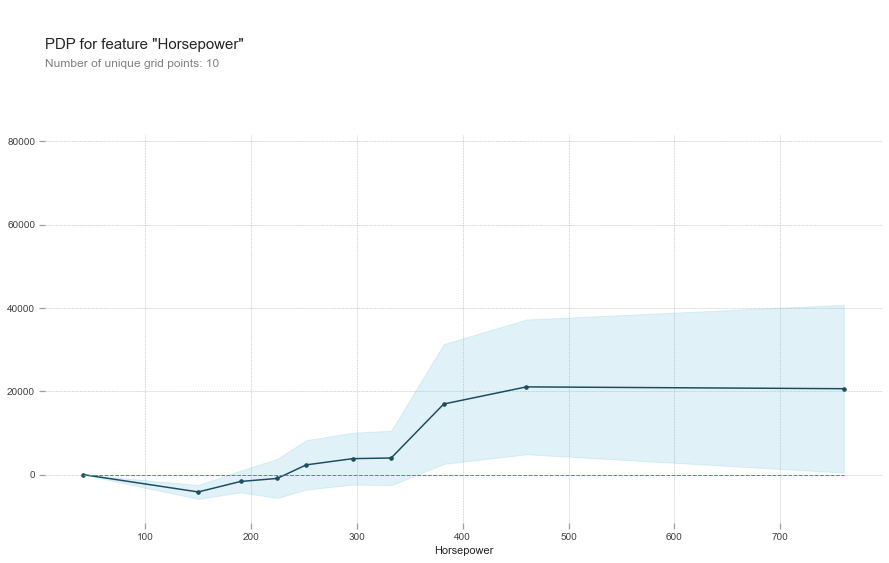 |
|:--:| 
| *Partial Dependence Plot* |

* SHAP values break down an individual prediction to show the impact of each feature. 
* It shows the impact of having a certain value for a given feature compared to if that feature took some baseline value. 

| 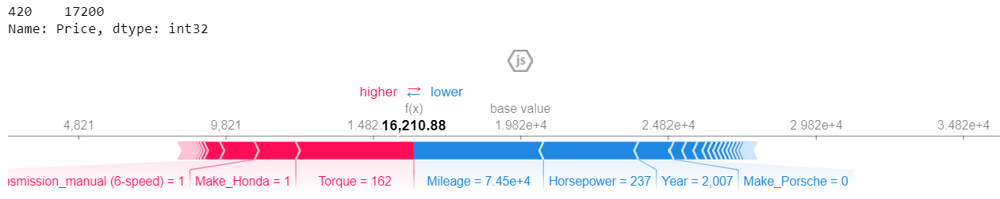 |
|:--:| 
| *SHAP - SHapley Additive exPlanations* |

* SHAP summary plots show feature importance using permutation importance but also show how it's important. 
* Each dot has three characteristics:
  * Vertical location shows what feature it is depicting.
  * Color shows whether that feature was a high or low value for that row of the dataset.
  * Horizontal location shows whether the effect of that value caused a higher or lower prediction.

| 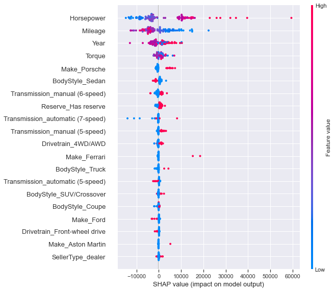 |
|:--:| 
| *SHAP Summary Plot* |

## Model Web Deployment
**Tech stack:** pickle, Flask, Heroku

* The final model was trained against the entire dataset. The model and one hot encoder were then serialized using pickle. 
* Pickle implements binary protocols for serializing and de-serializing a Python object structure. This character stream contains all the information necessary to reconstruct the object in another python script.
* A web app was made using flask, a lightweight WSGI web application framework. 
* The web app was deployed by linking GitHub with Heroku. Heroku is a container-based cloud Platform.
